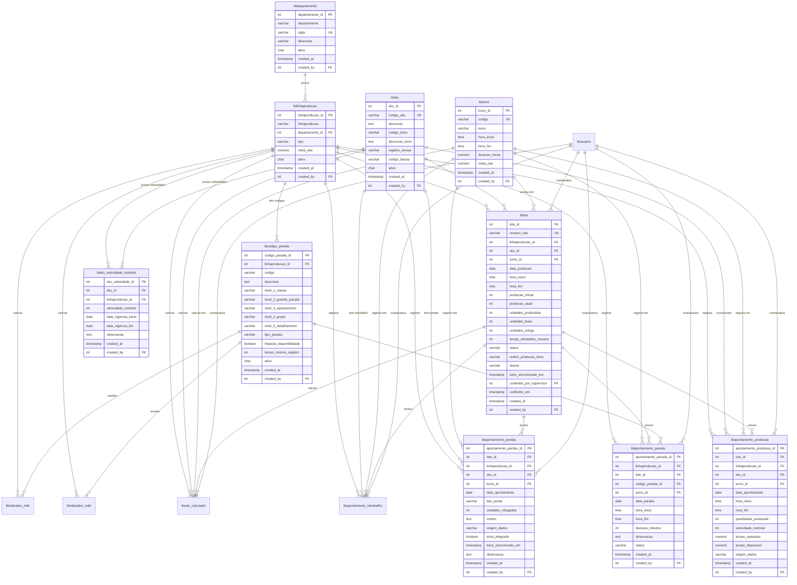

# Diagrama de Relacionamentos - Sistema OEE SicFar

## Diagrama Entidade-Relacionamento (ER)



## Relacionamentos Detalhados

### 1. Hierarquia Organizacional

```
tbdepartamento (Setor)
    └── tblinhaproducao (Linha de Produção)
            ├── tblote (Lote de Produção)
            ├── tbcodigo_parada (Códigos de Paradas)
            └── tbsku_velocidade_nominal (Velocidades Nominais)
```

### 2. Fluxo de Apontamento

```
tblote (Lote)
    ├── tbapontamento_producao (Produção)
    ├── tbapontamento_parada (Paradas)
    ├── tbapontamento_perdas (Perdas)
    ├── tbapontamento_retrabalho (Retrabalho)
    └── tboee_calculado (OEE Calculado)
```

### 3. Cálculo de OEE

```
tboee_calculado
    ├── Entrada: tbapontamento_producao
    ├── Entrada: tbapontamento_parada
    ├── Entrada: tbapontamento_perdas
    ├── Entrada: tbapontamento_retrabalho
    └── Saída: Disponibilidade, Performance, Qualidade, OEE
```

### 4. Indicadores Secundários

```
tbindicador_mtbf
    └── Entrada: tbapontamento_parada (tipo_parada = 'NAO_PLANEJADA')

tbindicador_mttr
    └── Entrada: tbapontamento_parada (duracao_minutos)
```

