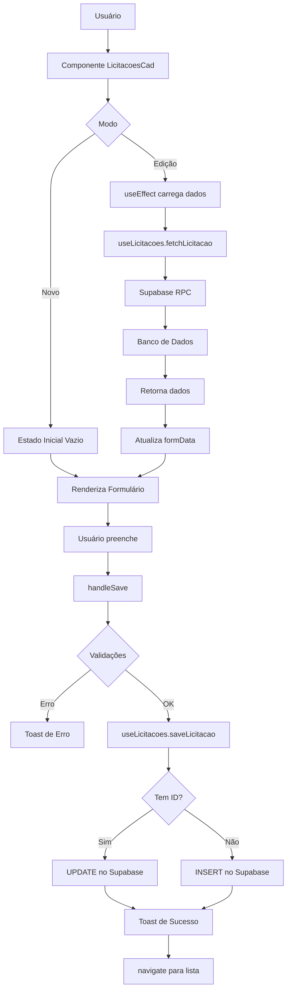
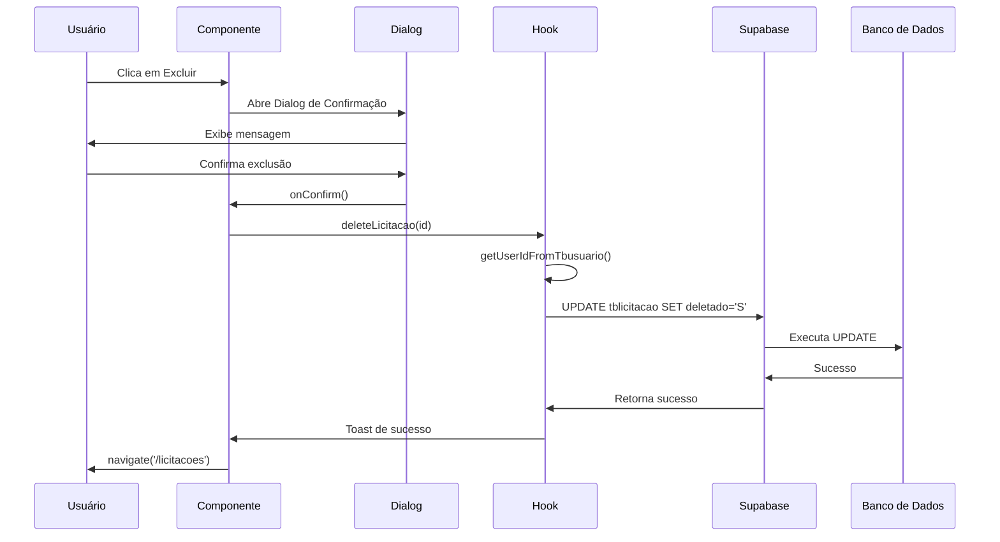
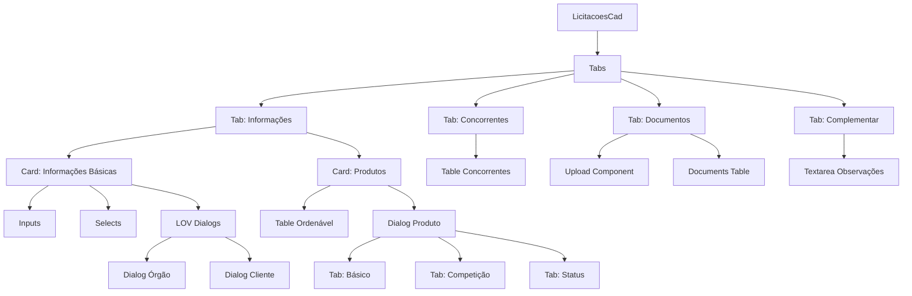
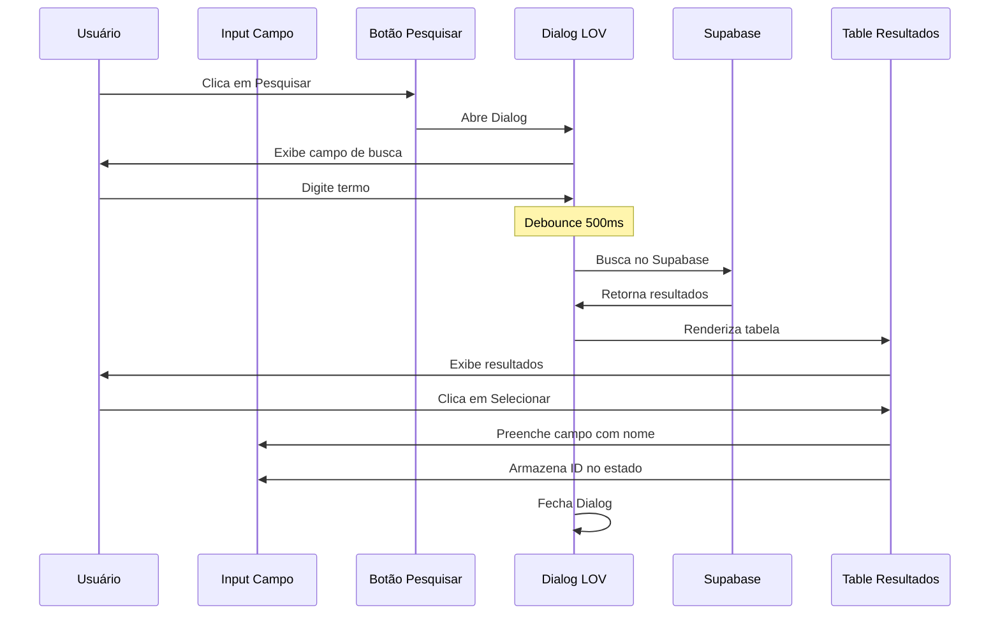
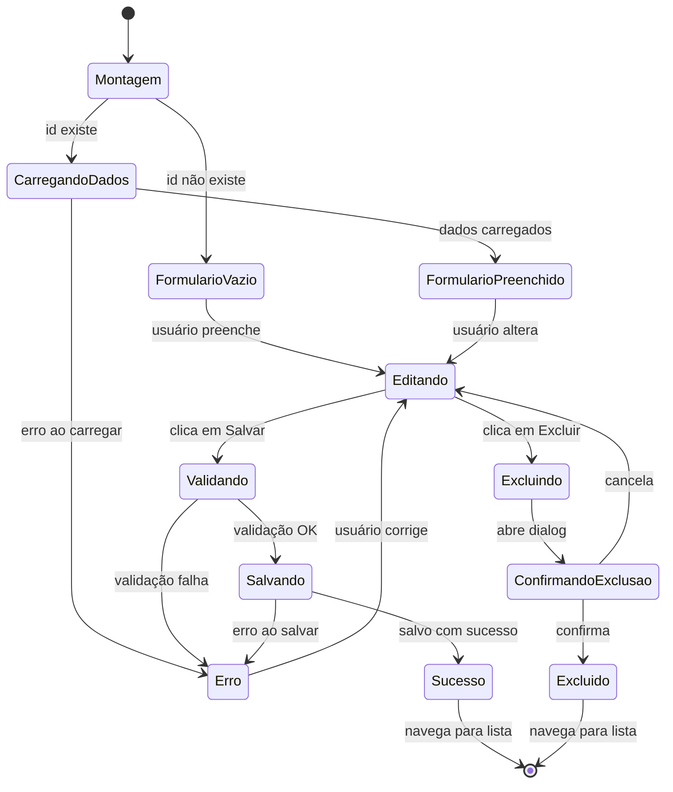
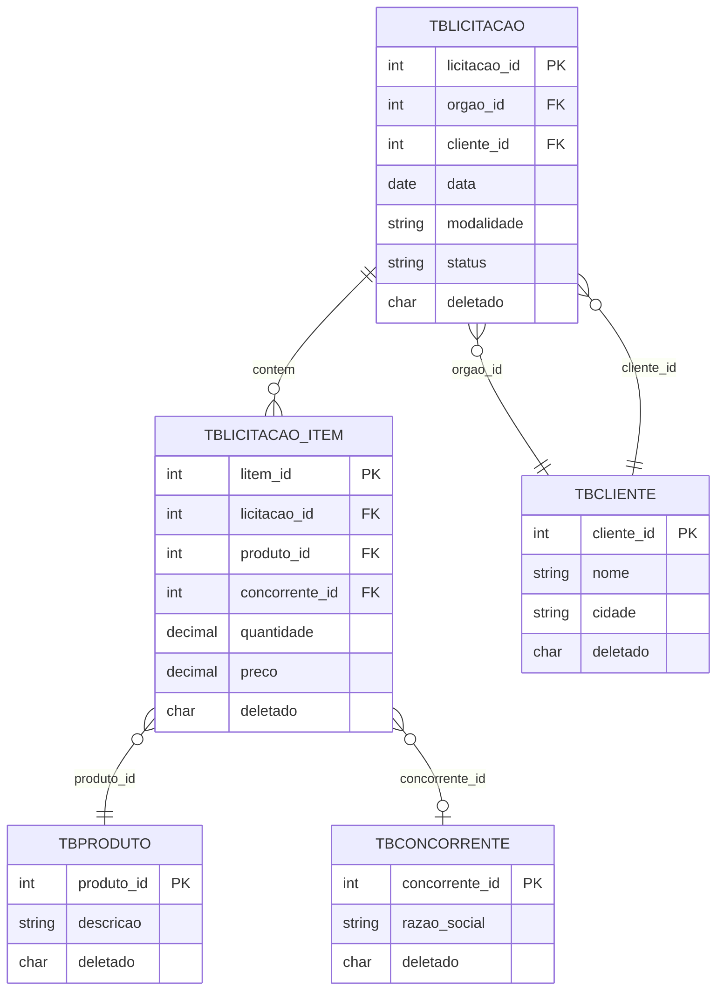
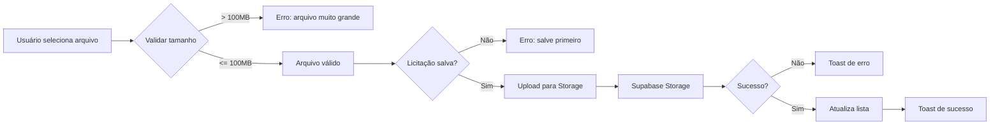
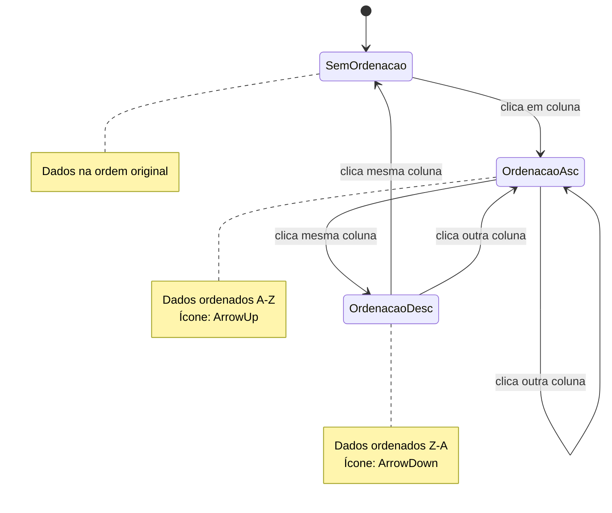
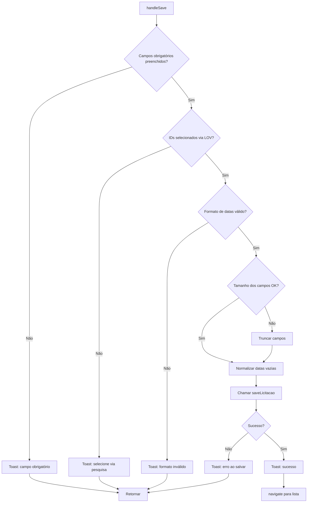
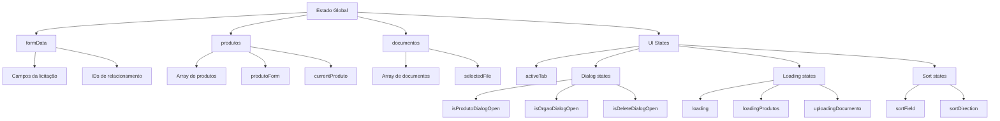

# Diagramas e Fluxogramas

## Fluxo de Dados Principal

## Fluxo de Soft Delete

## Arquitetura de Componentes

## Fluxo de LOV (List of Values)

## Ciclo de Vida do Componente

## Estrutura de Dados

## Fluxo de Upload de Documentos

## Padrão de Ordenação de Tabela

## Fluxo de Validação

## Hierarquia de Estados

