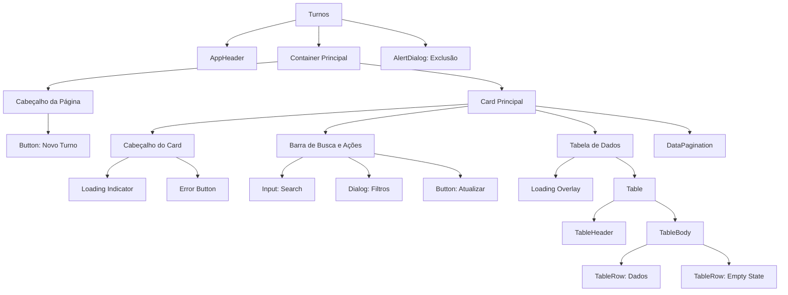
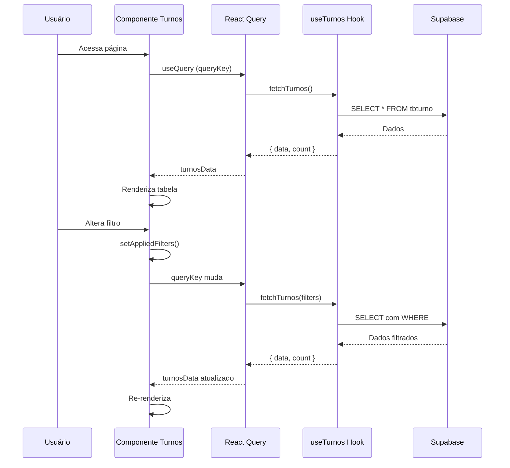

# Arquitetura e Componentes

## 📐 Visão Geral da Arquitetura

A página de Turnos segue uma arquitetura em camadas bem definida, separando responsabilidades e facilitando manutenção e testes.

```
┌─────────────────────────────────────────────────────────────┐
│                      AppHeader (Layout)                      │
└─────────────────────────────────────────────────────────────┘
                            ↓
┌─────────────────────────────────────────────────────────────┐
│                   Container Principal                        │
│  ┌───────────────────────────────────────────────────────┐  │
│  │              Cabeçalho da Página                      │  │
│  │  (Título + Descrição + Botão "Novo Turno")           │  │
│  └───────────────────────────────────────────────────────┘  │
│                            ↓                                 │
│  ┌───────────────────────────────────────────────────────┐  │
│  │                  Card Principal                        │  │
│  │  ┌─────────────────────────────────────────────────┐  │  │
│  │  │         Cabeçalho do Card                       │  │  │
│  │  │  (Título + Contador + Loading/Error States)     │  │  │
│  │  ├─────────────────────────────────────────────────┤  │  │
│  │  │         Barra de Busca e Ações                  │  │  │
│  │  │  (Input Search + Botão Filtros + Atualizar)     │  │  │
│  │  ├─────────────────────────────────────────────────┤  │  │
│  │  │         Tabela de Dados                         │  │  │
│  │  │  (Scroll interno, overlay de loading)           │  │  │
│  │  ├─────────────────────────────────────────────────┤  │  │
│  │  │         DataPagination                          │  │  │
│  │  │  (Info + Seletor + Navegação por páginas)       │  │  │
│  │  └─────────────────────────────────────────────────┘  │  │
│  └───────────────────────────────────────────────────────┘  │
└─────────────────────────────────────────────────────────────┘
                            ↓
┌─────────────────────────────────────────────────────────────┐
│                  Modais (Dialogs)                            │
│  - Dialog de Filtros                                         │
│  - AlertDialog de Confirmação de Exclusão                    │
└─────────────────────────────────────────────────────────────┘
```

---

## 🏗️ Estrutura de Código

### 1. Organização do Arquivo

O arquivo `Turnos.tsx` segue uma estrutura padronizada:

```typescript
// 1. Imports (linhas 1-46)
import { useState, useEffect, useMemo, useRef, useCallback } from 'react'
import { useNavigate, useSearchParams } from 'react-router-dom'
// ... outros imports

// 2. Constantes do Módulo (linhas 48-50)
const PAGE_SIZE_STORAGE_KEY = 'sysoee_turnos_items_per_page'
const PAGE_SIZE_OPTIONS = [25, 50, 100, 200] as const

// 3. Componente Principal (linhas 52-658)
export default function Turnos() {
  // 3.1. Hooks de navegação e URL
  // 3.2. Estados locais
  // 3.3. Refs
  // 3.4. Effects
  // 3.5. React Query
  // 3.6. Handlers de eventos
  // 3.7. Funções auxiliares
  // 3.8. Render (JSX)
}
```

### 2. Hierarquia de Componentes



---

## 📦 Componentes Shadcn/UI Utilizados

### Componentes de Layout

| Componente | Uso | Localização |
|------------|-----|-------------|
| **AppHeader** | Cabeçalho da aplicação | `@/components/layout/AppHeader` |

### Componentes de Formulário

| Componente | Uso | Localização |
|------------|-----|-------------|
| **Button** | Botões de ação | `@/components/ui/button` |
| **Input** | Campo de busca e filtros | `@/components/ui/input` |
| **Label** | Labels de formulário | `@/components/ui/label` |
| **Select** | Seletor de itens por página | `@/components/ui/select` |

### Componentes de Dados

| Componente | Uso | Localização |
|------------|-----|-------------|
| **Table** | Tabela de turnos | `@/components/ui/table` |
| **Badge** | Indicador de meta OEE | `@/components/ui/badge` |
| **DataPagination** | Paginação avançada | `@/components/ui/data-pagination` |

### Componentes de Feedback

| Componente | Uso | Localização |
|------------|-----|-------------|
| **Dialog** | Modal de filtros | `@/components/ui/dialog` |
| **AlertDialog** | Confirmação de exclusão | `@/components/ui/alert-dialog` |

---

## 🎯 Padrão de Organização de Código

### 1. Imports (Ordem Recomendada)

```typescript
// 1. Hooks do React
import { useState, useEffect, useMemo, useRef, useCallback } from 'react'

// 2. Hooks de roteamento
import { useNavigate, useSearchParams } from 'react-router-dom'

// 3. Componentes UI (Shadcn)
import { Button } from '@/components/ui/button'
import { Input } from '@/components/ui/input'
// ...

// 4. Componentes de layout customizados
import { AppHeader } from '@/components/layout/AppHeader'

// 5. Hooks customizados
import { useTurnos } from '@/hooks/useTurnos'

// 6. Tipos TypeScript
import { TurnoFormData, calcularDuracaoTurno } from '@/types/turno'

// 7. Ícones
import { Plus, Search, Pencil, Trash2, Clock, Target, RefreshCw, Filter, Loader2, AlertCircle, Eye } from 'lucide-react'

// 8. Bibliotecas externas
import { useQuery } from '@tanstack/react-query'
```

### 2. Constantes do Módulo

```typescript
// Constantes estáveis no escopo do módulo para evitar warnings de dependências
const PAGE_SIZE_STORAGE_KEY = 'sysoee_turnos_items_per_page'
const PAGE_SIZE_OPTIONS = [25, 50, 100, 200] as const
```

**Por quê?**
- Evita recriação em cada render
- Previne warnings de dependências em `useEffect` e `useCallback`
- Facilita manutenção (valores centralizados)

### 3. Estrutura do Componente

```typescript
export default function Turnos() {
  // 1. Hooks de navegação e URL (sempre no topo)
  const navigate = useNavigate()
  const [searchParams, setSearchParams] = useSearchParams()
  
  // 2. Estados locais (agrupados por funcionalidade)
  const [searchTerm, setSearchTerm] = useState('')
  const [currentPage, setCurrentPage] = useState(1)
  const [itemsPerPage, setItemsPerPage] = useState(25)
  
  // 3. Refs
  const tableContainerRef = useRef<HTMLDivElement | null>(null)
  const paginationRef = useRef<HTMLDivElement | null>(null)
  
  // 4. Hooks customizados
  const { fetchTurnos, deleteTurno } = useTurnos()
  
  // 5. Effects
  useEffect(() => {
    // Lógica de inicialização
  }, [])
  
  // 6. React Query
  const { data, isLoading, isFetching, error, refetch } = useQuery({
    // Configuração
  })
  
  // 7. Variáveis derivadas (useMemo)
  const appliedCount = useMemo(() => {
    // Cálculo
  }, [dependencies])
  
  // 8. Handlers de eventos
  const handlePageChange = (page: number) => {
    // Lógica
  }
  
  // 9. Funções auxiliares
  const formatarHorario = (hora: string) => {
    // Formatação
  }
  
  // 10. Render (JSX)
  return (
    <>
      {/* Estrutura JSX */}
    </>
  )
}
```

---

## 🔄 Fluxo de Dados



---

**Próximo:** [Gerenciamento de Estado →](./02-gerenciamento-estado.md)

