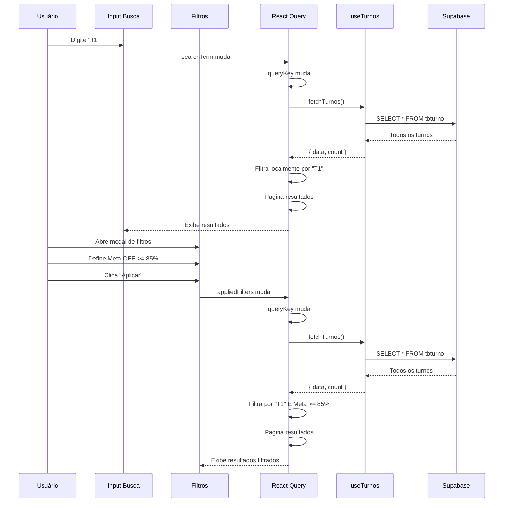

# Funcionalidades

## 🎯 Visão Geral

A página de Turnos implementa um conjunto completo de funcionalidades para gerenciamento de dados, incluindo:

1. **Paginação Avançada** - Navegação por números de página com elipses
2. **Busca em Tempo Real** - Filtro instantâneo por código ou nome
3. **Sistema de Filtros** - Modal dedicado com múltiplos critérios
4. **CRUD Completo** - Create, Read, Update, Delete
5. **Loading States** - Indicadores visuais de carregamento
6. **Tratamento de Erros** - Feedback claro ao usuário

---

## 📄 1. Paginação Avançada

### Componente DataPagination

```typescript
<DataPagination
  containerRef={paginationRef}
  currentPage={currentPage}
  totalPages={totalPages}
  onPageChange={handlePageChange}
  itemsPerPage={itemsPerPage}
  totalItems={totalItems}
  showInfo={true}
  pageSizeOptions={PAGE_SIZE_OPTIONS as unknown as number[]}
  onItemsPerPageChange={(size) => {
    setItemsPerPage(size)
    setCurrentPage(1)
    // Atualiza query param para refletir primeira página
    try {
      const params = new URLSearchParams(searchParams)
      params.delete('page')
      setSearchParams(params, { replace: true })
    } catch { /* noop */ }
    try { 
      localStorage.setItem(PAGE_SIZE_STORAGE_KEY, String(size))
    } catch { /* noop */ }
  }}
/>
```

### Funcionalidades

#### 1.1. Navegação por Números de Página

```
[Anterior] 1 2 3 4 ... 10 [Próximo]
```

**Lógica de Exibição:**
- **≤5 páginas:** Mostra todas
- **Início (página 1-3):** `1 2 3 4 ... último`
- **Meio (página 4-7):** `1 ... atual-1 atual atual+1 ... último`
- **Final (página 8-10):** `1 ... antepenúltimo penúltimo último`

**Implementação:**
```typescript
const getVisiblePages = () => {
  const pages = [];
  const maxVisible = 5;
  
  if (totalPages <= maxVisible) {
    for (let i = 1; i <= totalPages; i++) {
      pages.push(i);
    }
  } else {
    if (currentPage <= 3) {
      for (let i = 1; i <= Math.min(4, totalPages); i++) {
        pages.push(i);
      }
      if (totalPages > 4) pages.push('ellipsis', totalPages);
    } else if (currentPage >= totalPages - 2) {
      pages.push(1);
      if (totalPages > 4) pages.push('ellipsis');
      for (let i = Math.max(totalPages - 3, 2); i <= totalPages; i++) {
        pages.push(i);
      }
    } else {
      pages.push(1, 'ellipsis');
      for (let i = currentPage - 1; i <= currentPage + 1; i++) {
        pages.push(i);
      }
      pages.push('ellipsis', totalPages);
    }
  }
  
  return pages;
};
```

#### 1.2. Seletor de Itens por Página

```typescript
const PAGE_SIZE_OPTIONS = [25, 50, 100, 200] as const
```

**Comportamento:**
- Salva preferência em `localStorage`
- Reseta para página 1 ao mudar
- Remove parâmetro `page` da URL

#### 1.3. Informações de Paginação

```
Mostrando 26 a 50 de 150 resultados
```

**Cálculo:**
```typescript
const startItem = (currentPage - 1) * itemsPerPage + 1;
const endItem = Math.min(currentPage * itemsPerPage, totalItems);
```

---

## 🔍 2. Busca em Tempo Real

### Implementação

```typescript
const [searchTerm, setSearchTerm] = useState('')

// Input de busca
<Input
  type="text"
  placeholder="Pesquisar por código ou nome do turno..."
  className="pl-10 py-2 w-full border border-gray-200 rounded-md"
  value={searchTerm}
  onChange={(e) => setSearchTerm(e.target.value)}
/>
```

### Filtro Automático

```typescript
// Dentro do queryFn do React Query
if (searchTerm) {
  const term = searchTerm.toLowerCase()
  filteredData = filteredData.filter(
    (turno) =>
      turno.codigo.toLowerCase().includes(term) ||
      turno.turno.toLowerCase().includes(term)
  )
}
```

### Reset de Página

```typescript
// Resetar página para 1 quando searchTerm mudar
useEffect(() => {
  setCurrentPage(1)
  setSearchParams((prev) => {
    const newParams = new URLSearchParams(prev)
    newParams.set('page', '1')
    return newParams
  })
}, [searchTerm, appliedFilters, setSearchParams])
```

**Por quê?**
- ✅ Evita mostrar "página 5" quando há apenas 2 páginas de resultados
- ✅ UX consistente (sempre começa do início após filtrar)

---

## 🎛️ 3. Sistema de Filtros

### Modal de Filtros

```typescript
<Dialog open={openFilterDialog} onOpenChange={(o) => {
  setOpenFilterDialog(o)
  if (o) setDraftFilters({ ...appliedFilters })
}}>
  <DialogTrigger asChild>
    <Button variant="outline" className="...">
      <Filter className="h-4 w-4" />
      Filtros
      {appliedCount > 0 && (
        <Badge variant="secondary" className="ml-1">{appliedCount}</Badge>
      )}
    </Button>
  </DialogTrigger>
  <DialogContent className="w-[95vw] max-w-[600px] max-h-[80vh] overflow-auto p-0">
    {/* Campos de filtro */}
  </DialogContent>
</Dialog>
```

### Campos de Filtro

1. **Código** - Filtro de texto (backend)
2. **Nome do Turno** - Filtro de texto (backend)
3. **Meta OEE Mínima** - Filtro numérico (local)
4. **Meta OEE Máxima** - Filtro numérico (local)

### Aplicação de Filtros

```typescript
const applyFilters = () => {
  setAppliedFilters({ ...draftFilters })
  setCurrentPage(1)
  try {
    const params = new URLSearchParams(searchParams)
    params.delete('page')
    setSearchParams(params, { replace: true })
  } catch { /* noop */ }
  setOpenFilterDialog(false)
}
```

### Limpeza de Filtros

```typescript
const clearFilters = () => {
  const cleared = {
    codigo: '',
    turno: '',
    metaOeeMin: '',
    metaOeeMax: '',
  }
  setDraftFilters(cleared)
  setAppliedFilters(cleared)
  setCurrentPage(1)
  try {
    const params = new URLSearchParams(searchParams)
    params.delete('page')
    setSearchParams(params, { replace: true })
  } catch { /* noop */ }
}
```

### Contador de Filtros Ativos

```typescript
const appliedCount = useMemo(() => {
  let count = 0
  const f = appliedFilters
  if (f.codigo) count++
  if (f.turno) count++
  if (f.metaOeeMin) count++
  if (f.metaOeeMax) count++
  return count
}, [appliedFilters])
```

**Exibição:**
```tsx
{appliedCount > 0 && (
  <Badge variant="secondary" className="ml-1">{appliedCount}</Badge>
)}
```

---

## ✏️ 4. CRUD Completo

### 4.1. Create (Criar)

```typescript
const handleNovo = () => {
  navigate('/turno/novo')
}
```

**Navegação:** Redireciona para página de formulário

### 4.2. Read (Ler)

```typescript
const handleVisualizar = (turno: TurnoFormData) => {
  navigate(`/turno/${turno.id}?page=${currentPage}`)
}
```

**Preservação de Estado:**
- Passa `page` como query param
- Ao voltar, retorna para mesma página

### 4.3. Update (Atualizar)

```typescript
const handleEditar = (turno: TurnoFormData) => {
  navigate(`/turno/${turno.id}?page=${currentPage}`)
}
```

**Mesmo comportamento de visualização** (modo edição definido no formulário)

### 4.4. Delete (Excluir)

```typescript
const handleExcluirClick = (turno: TurnoFormData) => {
  setTurnoToDelete(turno)
  setIsDeleteDialogOpen(true)
}

const handleExcluirConfirm = async () => {
  if (turnoToDelete?.id) {
    try {
      await deleteTurno(turnoToDelete.id)
      setIsDeleteDialogOpen(false)
      setTurnoToDelete(null)
      await refetch()  // Recarrega lista
    } catch (error) {
      console.error('Erro ao excluir turno:', error)
    }
  }
}
```

**Fluxo:**
1. Usuário clica em "Excluir"
2. Modal de confirmação abre
3. Usuário confirma
4. Soft delete no banco (deletado = 'S')
5. Lista é recarregada automaticamente

---

## ⏳ 5. Loading States

### 5.1. Loading Inicial

```typescript
{isLoading && (
  <div className="flex items-center gap-2 text-sm text-gray-500">
    <Loader2 className="h-4 w-4 animate-spin" />
    Carregando...
  </div>
)}
```

**Quando:** Primeira carga da página

### 5.2. Loading Overlay

```typescript
{isFetching && (
  <div className="absolute inset-0 z-10 flex items-center justify-center bg-white/70 backdrop-blur-[1px]">
    <div className="flex items-center gap-2 text-[#242f65] text-sm font-medium">
      <Loader2 className="h-4 w-4 animate-spin" />
      Aguarde, carregando dados...
    </div>
  </div>
)}
```

**Quando:** Revalidação de dados (filtros, busca, paginação)

**Estilo:**
- Fundo semi-transparente (`bg-white/70`)
- Blur sutil (`backdrop-blur-[1px]`)
- Z-index alto (`z-10`)

---

## ❌ 6. Tratamento de Erros

### 6.1. Erro na Consulta

```tsx
{error && (
  <div className="flex items-center gap-2">
    <Button
      variant="outline"
      size="sm"
      onClick={() => refetch()}
      className="flex items-center gap-2 text-red-600 hover:text-red-700 border-red-300"
    >
      <AlertCircle className="h-4 w-4" />
      Tentar novamente
    </Button>
  </div>
)}
```

**Características:**
- Botão de retry visível
- Cor vermelha para indicar erro
- Ícone de alerta

### 6.2. Empty State

```tsx
{turnosList.length === 0 && !isLoading ? (
  <tr>
    <td colSpan={7} className="px-4 md:px-6 py-8 text-center">
      {error ? (
        <div className="flex flex-col items-center gap-3 text-red-500">
          <AlertCircle className="h-8 w-8" />
          <div>
            <p className="font-medium">Erro ao carregar turnos</p>
            <p className="text-sm text-gray-500">
              Verifique sua conexão e tente novamente
            </p>
          </div>
        </div>
      ) : (
        <div className="text-gray-500">
          {searchTerm || appliedCount > 0
            ? 'Nenhum turno encontrado com os filtros aplicados.'
            : 'Nenhum turno cadastrado.'}
        </div>
      )}
    </td>
  </tr>
) : null}
```

**Diferenciação:**
- **Com erro:** Mensagem de erro + ícone vermelho
- **Sem dados (com filtros):** "Nenhum turno encontrado com os filtros aplicados"
- **Sem dados (sem filtros):** "Nenhum turno cadastrado"

---

## 🔄 7. Sincronização de Estado

### 7.1. URL ↔ Página Atual

```typescript
// Ler da URL na montagem
const [currentPage, setCurrentPage] = useState(() => {
  const p = Number(searchParams.get('page'))
  return Number.isFinite(p) && p > 0 ? p : 1
})

// Atualizar URL ao mudar página
const handlePageChange = (page: number) => {
  const next = Math.max(1, page)
  setCurrentPage(next)

  try {
    const params = new URLSearchParams(searchParams)
    if (next > 1) {
      params.set('page', String(next))
    } else {
      params.delete('page')  // URL limpa na página 1
    }
    setSearchParams(params, { replace: true })
  } catch { /* noop */ }
}
```

**Benefícios:**
- ✅ URL compartilhável (usuário pode copiar e colar)
- ✅ Botão "Voltar" funciona corretamente
- ✅ Refresh mantém estado

### 7.2. localStorage ↔ Itens por Página

```typescript
// Carregar preferência na montagem
useEffect(() => {
  try {
    const raw = localStorage.getItem(PAGE_SIZE_STORAGE_KEY)
    const parsed = raw ? parseInt(raw, 10) : NaN
    if (PAGE_SIZE_OPTIONS.includes(parsed as any)) {
      setItemsPerPage(parsed)
    }
  } catch { /* noop */ }
}, [])

// Salvar ao mudar
const handleItemsPerPageChange = (size: number) => {
  setItemsPerPage(size)
  setCurrentPage(1)

  try {
    const params = new URLSearchParams(searchParams)
    params.delete('page')
    setSearchParams(params, { replace: true })
  } catch { /* noop */ }

  try {
    localStorage.setItem(PAGE_SIZE_STORAGE_KEY, String(size))
  } catch { /* noop */ }
}
```

**Benefícios:**
- ✅ Preferência do usuário persistida entre sessões
- ✅ Funciona mesmo se localStorage estiver desabilitado
- ✅ Validação contra valores permitidos

---

## 🎨 8. Formatação de Dados

### 8.1. Horário

```typescript
const formatarHorario = (hora: string) => {
  if (!hora) return '-'
  return hora  // Já vem no formato HH:MM do banco
}
```

### 8.2. Meta OEE

```typescript
const formatarMetaOEE = (meta: number) => {
  return `${meta.toFixed(1)}%`
}
```

**Exemplo:** `85.0%`

### 8.3. Duração do Turno

```typescript
const formatarDuracao = (horaInicio: string, horaFim: string) => {
  if (!horaInicio || !horaFim) return '-'

  const duracao = calcularDuracaoTurno(horaInicio, horaFim)
  const horas = Math.floor(duracao / 60)
  const minutos = duracao % 60

  return `${horas}h${minutos > 0 ? ` ${minutos}min` : ''}`
}
```

**Exemplo:** `8h`, `8h 30min`

### 8.4. Badge de Meta OEE

```typescript
const getBadgeMetaOEE = (meta: number): 'default' | 'secondary' | 'destructive' | 'outline' | 'success' | 'warning' | 'info' => {
  if (meta >= 90) return 'success'   // Verde
  if (meta >= 85) return 'info'      // Azul
  if (meta >= 80) return 'warning'   // Amarelo
  return 'destructive'               // Vermelho
}
```

**Uso:**
```tsx
<Badge variant={getBadgeMetaOEE(turno.metaOee)}>
  <Target className="h-3 w-3 mr-1" />
  {formatarMetaOEE(turno.metaOee)}
</Badge>
```

---

## 🔍 9. Fluxo Completo de Interação

### Cenário: Usuário Busca e Filtra Dados



---

**Próximo:** [Padrões de UI/UX →](./04-padroes-ui-ux.md)

