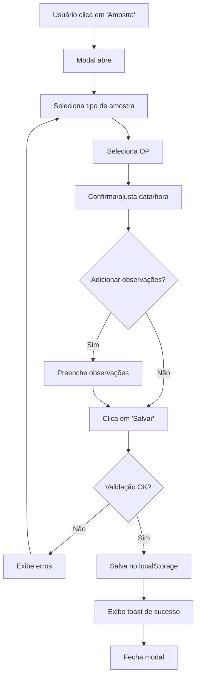

# Cadastro de Amostras

## 📋 Visão Geral

O módulo de **Cadastro de Amostras** permite o registro contemporâneo de coletas de amostras de **Flash de Linha** e **Reator** durante o processo produtivo, vinculadas às Ordens de Produção (OPs) em andamento.

## 🎯 Objetivo

Garantir rastreabilidade completa das amostras coletadas durante a produção, seguindo os princípios **ALCOA+** exigidos pelas Boas Práticas de Fabricação (BPF) farmacêutica.

## 🔑 Funcionalidades Principais

### 1. Acesso ao Cadastro
- **Localização**: Página de Operação (`/operacao`)
- **Botão**: "Amostra" no carrossel de ações do header
- **Ícone**: FileText (documento)

### 2. Modal de Cadastro

#### Campos Obrigatórios
1. **Tipo de Amostra** (Select)
   - Flash de Linha
   - Reator

2. **Ordem de Produção** (Select)
   - Lista apenas OPs em produção (exclui "Planejado" e "Concluído")
   - Exibe: Número da OP, Produto, Lote e Fase atual
   - Formato: `OP123 - Produto XYZ - Lote ABC (Envase)`

3. **Data e Hora da Coleta** (DateTime)
   - Preenchido automaticamente com data/hora atual
   - Editável para ajustes se necessário
   - Formato: `datetime-local` (YYYY-MM-DDTHH:mm)

#### Campos Opcionais
4. **Observações** (Textarea)
   - Informações adicionais sobre a coleta
   - Contador de caracteres
   - Sem limite de tamanho

### 3. Validações

#### Validação de Campos Obrigatórios
- ✅ Tipo de amostra deve ser selecionado
- ✅ OP deve ser selecionada
- ✅ Data e hora da coleta devem ser informadas
- ❌ Exibe mensagens de erro específicas para cada campo
- ❌ Toast de erro se tentar salvar com campos inválidos

#### Validação de Dados
- ✅ OP selecionada deve existir na lista
- ✅ Data/hora convertida para ISO 8601 para armazenamento

### 4. Armazenamento

#### LocalStorage
- **Chave**: `sysoee_amostras`
- **Formato**: Array de objetos `DadosAmostra`
- **Persistência**: Mantém histórico completo de amostras

#### Estrutura de Dados Salvos
```typescript
{
  id: string                    // Gerado automaticamente (timestamp + random)
  tipoAmostra: TipoAmostra     // "Flash de Linha" | "Reator"
  opId: string                 // ID da OP
  opDescricao: string          // "Produto - Lote XXX"
  dataHoraColeta: string       // ISO 8601
  observacoes?: string         // Opcional
  usuarioId: number            // ID do usuário (TODO: integrar autenticação)
  usuarioNome: string          // Nome do usuário (TODO: integrar autenticação)
  dataHoraCadastro: string     // ISO 8601 (timestamp do cadastro)
}
```

### 5. Princípios ALCOA+

O sistema garante conformidade com ALCOA+:

- ✅ **Atribuível**: Registra usuário que coletou (usuarioId + usuarioNome)
- ✅ **Legível**: Interface clara e dados estruturados
- ✅ **Contemporâneo**: Data/hora da coleta registrada no momento
- ✅ **Original**: Dados salvos sem modificações posteriores
- ✅ **Exato**: Validações garantem precisão dos dados
- ✅ **Completo**: Todos os campos relevantes são capturados
- ✅ **Consistente**: Formato padronizado de dados
- ✅ **Durável**: Armazenamento persistente (localStorage + futuro banco)
- ✅ **Disponível**: Dados acessíveis para consulta e auditoria

### 6. Feedback ao Usuário

#### Toast de Sucesso
```
✅ Amostra cadastrada com sucesso!
Flash de Linha - OP OP123
```

#### Toast de Erro
```
❌ Erro ao cadastrar amostra
Não foi possível salvar o cadastro. Tente novamente.
```

#### Validação em Tempo Real
- Campos obrigatórios destacados em vermelho quando inválidos
- Ícone de alerta ao lado da mensagem de erro
- Mensagens específicas para cada tipo de erro

## 🔧 Componentes Técnicos

### Arquivos Principais

1. **Modal**: `src/components/operacao/ModalCadastroAmostra.tsx`
   - Componente do modal de cadastro
   - Validações de formulário
   - Interface com usuário

2. **Página**: `src/pages/Operacao.tsx`
   - Integração do modal
   - Handlers de abertura/fechamento
   - Lógica de salvamento

3. **Tipos**: `src/types/amostra.ts`
   - Definições TypeScript
   - Interfaces e tipos
   - DTOs

### Dependências UI
- `Dialog` (shadcn/ui): Container do modal
- `Select` (shadcn/ui): Seleção de tipo e OP
- `Input` (shadcn/ui): Campo de data/hora
- `Textarea` (shadcn/ui): Campo de observações
- `Button` (shadcn/ui): Ações do modal
- `Label` (shadcn/ui): Rótulos dos campos
- `toast` (sonner): Notificações

## 📊 Fluxo de Uso



## 🚀 Próximas Implementações

### Fase 1 - MVP (Atual)
- ✅ Modal de cadastro
- ✅ Validações básicas
- ✅ Armazenamento em localStorage
- ✅ Princípios ALCOA+

### Fase 2 - Integração Backend
- ⏳ API de cadastro de amostras
- ⏳ Persistência em banco de dados (Supabase)
- ⏳ Autenticação real de usuários
- ⏳ Sincronização localStorage → Banco

### Fase 3 - Consultas e Relatórios
- ⏳ Tela de consulta de amostras
- ⏳ Filtros avançados (período, tipo, OP, usuário)
- ⏳ Exportação de relatórios
- ⏳ Histórico de amostras por OP

### Fase 4 - Rastreabilidade Completa
- ⏳ Integração com sistema de qualidade
- ⏳ Resultados de análises
- ⏳ Status de aprovação/reprovação
- ⏳ Assinatura eletrônica (21 CFR Part 11)

## 📝 Notas Técnicas

### Geração de IDs
```typescript
function gerarIdRegistro(): string {
  return `${Date.now()}-${Math.random().toString(36).substring(2, 9)}`
}
```
- Formato: `timestamp-random`
- Exemplo: `1704067200000-k7x9m2p`
- Garante unicidade mesmo em cadastros simultâneos

### Conversão de Data/Hora
```typescript
// Input do usuário (datetime-local)
const dataHoraLocal = "2024-01-01T14:30"

// Conversão para ISO 8601
const dataHoraISO = new Date(dataHoraLocal).toISOString()
// Resultado: "2024-01-01T17:30:00.000Z" (UTC)
```

### Filtragem de OPs Disponíveis
```typescript
const opsDisponiveis = ops.filter(
  (op) => !['Planejado', 'Concluído'].includes(op.fase)
)
```
- Exclui OPs que ainda não iniciaram
- Exclui OPs já finalizadas
- Mostra apenas OPs em produção ativa

## 🔍 Auditoria e Rastreabilidade

Todos os registros de amostras incluem:
- ✅ Quem coletou (usuário)
- ✅ Quando coletou (data/hora da coleta)
- ✅ Quando registrou (data/hora do cadastro)
- ✅ Qual OP estava em produção
- ✅ Qual tipo de amostra
- ✅ Observações relevantes

Isso garante rastreabilidade completa para auditorias regulatórias (ANVISA, FDA, etc.).

